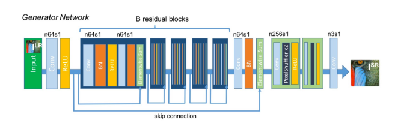
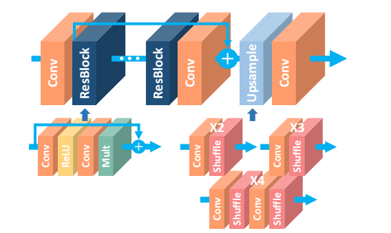

# EDSR_SRResNet
EDSR_SRResNet ReImplement by tensorflow


## Software Environment:
tensorflow (>=1.4) <br>
tensorlayer (>=1.8.0)

## How to Run

Download the DIV2K dataset in DIV2K_train_HR folder.  <br>
If you want to train EDSR model, you can run 
```bash
python edsr.py
```
If you want to train SRResNet model, you can run 
```bash
python srresnet.py
```

## SRResNet Network:
I ref to this paper "SRGAN" ["Photo-Realistic Single Image Super-Resolution Using a Generative Adversarial Network"](https://arxiv.org/abs/1609.04802)
and the code from SRGAN_tensorlayer(https://github.com/tensorlayer/srgan)

<div align = "center">
    
</div>

## EDSR Network:
EDSR model is came from "EDSR" ["Enhanced Deep Residual Networks for Single Image Super-Resolution"](https://arxiv.org/abs/1707.02921)

<div align = "center">
    
</div>


## DataSet Downloader:
DIV2K DataSet can be downloaded https://data.vision.ee.ethz.ch/cvl/DIV2K/